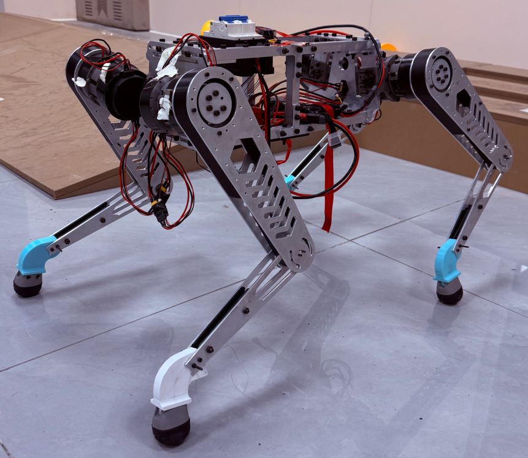

# RC_WheelLeg

山东华宇工学院 HYNova 战队轮足机器人项目的开源仓库。

我们是一支从零起步的新队伍。从社团初创到战队成立，从学校历史上首次电赛国一，到 RC 国一，一路走来积累了机械、硬件、控制、仿真和强化学习方面的实践经验。我们将备赛过程中整理出的机械、硬件、软件、BOM、装配资料及各类注意事项逐步开源，希望为起步较晚、正在准备 Robocon 的队伍提供参考。

## 战队与项目

- 参赛项目：仿生足式障碍赛
- 最终成绩：全国一等奖，第 7 名，前 5%
- 主要平台：16DOF 串联轮足机器人
- 当前仓库版本：8DOF 串联足实机验证版（中期检查版）

感谢 Lain 佬的 [LocoWiki](https://github.com/LocoWiki/LocoWiki) 项目对早期方案的大量参考与启发，特别感谢留形科技为 2026 赛季提供的独家赞助与技术支持。

## 开源内容

当前公开内容按阶段逐步整理：

- 本目录为中期版本的 8DOF 机械和软件资料，包含纯 A 板下位机方案、部分文档及调试注意事项。
- 早期 16DOF RL 四轮足版本的机械和软件资料，覆盖从训练、仿真到真机部署的完整链路，正在持续整理中。
- 后续将继续补充 16DOF 完整机械、硬件、软件、BOM、装配和部署资料。

项目主仓库：[RC_WheelLeg](https://github.com/zeitvex/RC_WheelLeg)

> 由于资料较多，仓库内容会分阶段发布。请以各目录说明和 Git Tag 对应的版本为准。

## 成员

| 成员 | 方向 | 主要职责 | 联系方式 |
| --- | --- | --- | --- |
| 晨小荼（chentu12） | 队长 / 算法 | 构建初创平台；前期负责 8DOF 平台构建与算法，参与硬件和算法方案讨论；后期负责 16DOF 轮足机器人 Odin1 平台建设与硬件实现，负责企业及组委对接，持续推进项目落地。 | WX: `r15288746596`<br>QQ: `2898468947` |
| 时维（zeitvex） | 技术负责人 / 项目管理 | 主导中后期 16DOF 轮足机器人的软件与控制架构，参与机械与硬件方案确定；负责强化学习训练、仿真验证、真机部署、导航集成及项目进度推进和体系建设。 | WX: `zeitvex`<br>QQ: `3156045992` |
| Dichen（Dichen33） | 电控 / 算法 | 负责电控与算法软件架构设计及系统集成。前期完成 8DOF 电机控制、CAN 通信、PID、腿部逆解与步态调试；中后期面向 16DOF 平台负责电机控制、传感器接入、状态估计和导航链路开发，辅助 Odin 接入，并参与仿真验证、强化学习训练及真机部署。 | WX: `Dichenccc`<br>QQ: `3357573813` |
| Sulcunfu（wusi321） | 电控 / 机械 | 参与前期 8DOF 及中后期 8DOF 到 16DOF 的机械升级设计；负责模型总装配、URDF 导出、仿真和算法验证，参与强化学习模型训练优化，配置 Linux 基础部署环境，对接 Odin1 视觉感知、里程计和 IMU 数据，并负责环境建图及导出。 | WX: `LcfNotFound`<br>QQ: `3299459360` |
| 王书琪（JadeCrane） | 机械 / 硬件 | 负责整机机械结构设计与电气硬件系统搭建；负责 8DOF 开源机械结构的硬件适配，以及 16DOF 架构整体机械结构的建模、优化和 CNC 供应链对接；负责电源管理 PCB 设计与 CAN 总线通信拓扑，为算法和仿真部署提供高刚度、高稳定性的硬件基础。 | WX: `DouSfJade`<br>QQ: `3070940094` |

## 交流与支持

欢迎正在备赛或对轮足机器人感兴趣的同学加入交流：

- 轮足开源交流群：[点击加入 QQ 群](https://qm.qq.com/q/HkdRYwtAYg)
- 群号：`767195310`


欢迎在群内交流机械设计、硬件搭建、下位机控制、仿真训练、强化学习和真机部署相关问题，也欢迎对资料整理提出建议。

当前内容为第一代 **8DOF 串联足实机验证版（中期检查版）**。该版本完成实机验证并通过项目中期检查，之后项目升级为 16DOF 串联轮足平台。

## 实机展示



[查看中期检查视频](06_assets/midterm_inspection.mp4)

## 版本状态

- 阶段：8DOF 中期检查版
- 平台：四腿串联足式机器人
- 自由度：8DOF，每条腿 2 个关节
- 主控：DJI RoboMaster A 型板兼容主控（STM32F427）
- 执行器：8 个灵足 RS02 关节电机
- 状态：已完成实机验证，通过中期检查

## 目录结构

```text
RC_WheelLeg/
├─ 01_doc/                       # 本项目的详细技术说明和使用文档
├─ 02_mechanical/                # 机械源文件
│  └─ CAD/                       # SolidWorks 零件与装配体
├─ 03_hardware/                  # 自研硬件资料；本版本暂无自研 PCB
├─ 04_firmware/                  # MCU 固件源码和构建工程
│  └─ stm32/dji_a_board/
│     ├─ RCPROyuan/              # Keil 工程
│     └─ rc_/                    # Keil 工程
├─ 05_software/                  # 上位机、仿真、训练和部署软件
├─ 06_assets/                    # 图片、视频和测试结果
├─ .gitignore
└─ README.md
```

## 主要功能

- 双 CAN 总线控制 8 个 RS02 关节电机。
- AT9S Pro 遥控器通过 DBUS 输入。
- 支持起立、趴下、步态使能、方向控制和软急停。
- 包含串联腿逆运动学、Trot 步态和 Jacobian 力矩映射。
- 针对同步带传动的绝对角度解耦结构进行运动学修正。
- 对腿部约 15 度外倾结构加入几何补偿。

## 工程入口

STM32 固件源码和 Keil 工程位于 `04_firmware/stm32/dji_a_board/`：

```text
04_firmware/stm32/dji_a_board/RCPROyuan/Project/RoboMentors_Board.uvprojx
04_firmware/stm32/dji_a_board/rc_/Project/RoboMentors_Board.uvprojx
```

两个工程的准确版本关系仍待确认，因此暂时保留原始名称，不做主观合并。

## 文档

- `01_doc/control`：运动学、姿态、运动和力控分析。
- `01_doc/firmware`：CAN、DBUS、电机协议和 Keil 工程结构说明。
- `01_doc/user_guide`：本机器人遥控器使用方法。

## 机械资料

`02_mechanical/CAD` 包含整机、机身、单腿、动力单元及主要零件的 SolidWorks 源文件。建议保持文件间的相对位置不变后打开装配体。

更多实机视角见 [`06_assets/README.md`](06_assets/README.md)。

## 安全说明

- 首次运行前必须架空机器人，并确认电机 ID、方向和零位。
- 调试时必须确保遥控器软急停可用。
- 不应在未核对机械限位和电机映射的情况下直接烧录运行。
- 本项目可能产生较大关节力矩，使用者需要自行承担硬件调试风险。
- 零位设置需在机器人趴下状态，保持机身，各足端，各膝关节稳定完全接触地面时的关节角度为机械零点

## 版本管理

顶层领域目录从第一版开始固定，不为每次迭代新建 `v2`、`old` 或 `final` 目录。

- 当前 8DOF 版本整理完成后标记 Git Tag `v0.1.0`。
- 后续 16DOF 版本继续演进同一套目录，并标记新的 Tag。
- 旧版本通过 Git Tag 和 GitHub/Gitea Release 获取，不在最新主线中复制整套源码。
- 只有两个不兼容方案需要长期同时维护时，才建立明确的维护分支或变体目录。
