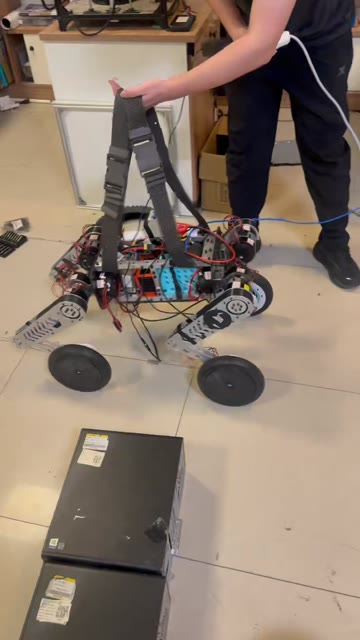

# RC\_WheelLeg

山东华宇工学院 HYNova 战队轮足机器人项目的开源仓库。

我们是一支从零起步的新队伍。从社团初创到战队成立，从学校历史上首次电赛国一，到 RC 国一，一路走来积累了机械、硬件、控制、仿真和强化学习方面的实践经验。我们将备赛过程中整理出的机械、硬件、软件、BOM、装配资料及各类注意事项逐步开源，希望为起步较晚、正在准备 Robocon 的队伍提供参考。

## 战队与项目

* 参赛项目：仿生足式障碍赛
* 最终成绩：全国一等奖，第 7 名，前 5%
* 主要平台：16DOF 串联轮足机器人
* 当前仓库版本：16DOF 串联轮足实机验证版（8DOF升级16DOF验证版）

感谢 Lain 佬的 [LocoWiki](https://github.com/LocoWiki/LocoWiki) 项目对早期方案的大量参考与启发以及青年顾问组对本战队的大力支持与帮助，特别感谢留形科技为 2026 赛季提供的独家赞助与技术支持。

## 开源内容

当前公开内容按阶段逐步整理：

* 本目录为中后期8DOF升级16DOF 初版机械和软件资料，包含SolidWorks 机械源文件，第一代 mjlab 训练任务和本地依赖、MuJoCo、Sim2Sim 和 MJCF及 IK 真机控制与第一代 Python Sim2Real，部分文档及调试注意事项。
* 后期 16DOF RL 四轮足版本的机械和软件资料，覆盖从训练、仿真到真机部署的完整链路，正在持续整理中。
* 后续将继续补充 16DOF 完整机械、硬件、软件、BOM、装配和部署资料。
* 上版本8DOF请查看[8dof分支](https://github.com/zeitvex/RC_WheelLeg/tree/8dof)

项目主仓库：[RC\_WheelLeg](https://github.com/zeitvex/RC_WheelLeg)

> 由于资料较多，仓库内容会分阶段发布。请以各目录说明和 Git Tag 对应的版本为准。

## 成员

|成员|方向|主要职责|联系方式|
|-|-|-|-|
|晨小荼(chentu12)|队长 / 算法|构建初创平台；前期负责 8DOF 平台构建与算法，参与硬件和算法方案讨论；后期负责 16DOF 轮足机器人 Odin1 平台建设与硬件实现，负责企业及组委对接，持续推进项目落地。|WX: `r15288746596`<br>QQ: `2898468947`|
|[时维](https://github.com/zeitvex)|技术负责人 / 项目管理|主导中后期 16DOF 轮足机器人的软件与控制架构，参与机械与硬件方案确定；负责强化学习训练、仿真验证、真机部署、导航集成及项目进度推进和体系建设。|WX: `zeitvex`<br>QQ: `3156045992`|
|Dichen(Dichen33)|电控 / 算法|负责电控与算法软件架构设计及系统集成。前期完成 8DOF 电机控制、CAN 通信、PID、腿部逆解与步态调试；中后期面向 16DOF 平台负责电机控制、传感器接入、状态估计和导航链路开发，辅助 Odin 接入，并参与仿真验证、强化学习训练及真机部署。|WX: `Dichenccc`<br>QQ: `3357573813`|
|[Sulcunfu](https://github.com/wusi321)|电控 / 机械|参与前期 8DOF 及中后期 8DOF 到 16DOF 的机械升级设计；负责模型总装配、URDF 导出、仿真和算法验证，参与强化学习模型训练优化，配置 Linux 基础部署环境，对接 Odin1 视觉感知、里程计和 IMU 数据，并负责环境建图及导出。|WX: `LcfNotFound`<br>QQ: `3299459360`|
|[王书琪](https://github.com/Beni-537)|机械 / 硬件|负责整机机械结构设计与电气硬件系统搭建；负责 8DOF 开源机械结构的硬件适配，以及 16DOF 架构整体机械结构的建模、优化和 CNC 供应链对接；负责电源管理 PCB 设计与 CAN 总线通信拓扑，为算法和仿真部署提供高刚度、高稳定性的硬件基础。|WX: `DouSfJade`<br>QQ: `3070940094`|

## 交流与支持

欢迎正在备赛或对轮足机器人感兴趣的同学加入交流：

* 轮足开源交流群：[点击加入 QQ 群](https://qm.qq.com/q/HkdRYwtAYg)
* 群号：`767195310`


欢迎在群内交流机械设计、硬件搭建、下位机控制、仿真训练、强化学习和真机部署相关问题，也欢迎对资料整理提出建议。

## 实机展示

当前仓库包含第一代 Sim2Real 真机测试记录，视频与预览图位于 `06\_assets/`：

[](06_assets/videos/early_sim2real.mp4)

该视频对应当前第一代 Python Sim2Real 与真机部署实现，时长约 41 秒。点击预览图可播放或下载原视频。

## 版本状态

* 阶段：16DOF 初期实验与第一代 Sim2Real 验证版本
* 平台：四轮足串联轮足机器人
* 构型：4 条轮腿，每条腿 3 个腿部关节，另有 4 个驱动轮
* 执行器：共 16 个执行器
* 控制路线：强化学习训练、MuJoCo 仿真、Sim2Sim 验证、Python Sim2Real 真机部署
* 当前状态：机械资料和第一代软件闭环已完成首轮整理；硬件、固件、BOM、装配和比赛最终版本仍在持续补充

## 目录结构

```text
RC\_WheelLeg/
├─ 01\_doc/          # 项目技术文档和使用说明
├─ 02\_mechanical/   # SolidWorks CAD、STEP 和机械源资料
├─ 03\_hardware/     # 自研电路、接线、BOM、传感器与计算平台说明
├─ 04\_firmware/     # MCU 或其他嵌入式控制器固件
├─ 05\_software/     # 强化学习训练、MuJoCo、Sim2Sim、Sim2Real 和工具
├─ 06\_assets/       # 图片、视频和测试结果
├─ .gitignore
└─ README.md
```

## 当前已整理内容

* SolidWorks 26 版本机械源文件，整机入口为 `02\_mechanical/CAD/solidworks/WEEKDOG.SLDASM`。
* 整机、身体、关节、腿部和轮组 STEP 文件，整机入口为 `02\_mechanical/STEP/WEEKDOG.STEP`。
* 第一代 `mjlab` 训练任务和本地依赖，位于 `05\_software/train/rc\_mjlab/`。
* 16DOF 轮足 MuJoCo/MJCF 模型、网格、Sim2Sim 验证工具和早期策略权重。
* IK 轨迹与早期真机控制探索，位于 `05\_software/real/ik\_real/`。
* 第一代 Python Sim2Real 部署栈，包含策略运行时、电机映射、IMU 接入、站立初始化、安全检查、Web 调试和标定工具。
* 第一代 Sim2Real 真机验证视频与预览图。

## 工程入口

机械资料：

* [`02\_mechanical/README.md`](02_mechanical/README.md)
* `02\_mechanical/CAD/solidworks/WEEKDOG.SLDASM`
* `02\_mechanical/STEP/WEEKDOG.STEP`

软件资料：

* [`05\_software/README.md`](05_software/README.md)
* [`05\_software/train/README.md`](05_software/train/README.md)
* [`05\_software/train/rc\_mjlab/README.md`](05_software/train/rc_mjlab/README.md)
* [`05\_software/real/README.md`](05_software/real/README.md)
* [`05\_software/real/sim2real/README.md`](05_software/real/sim2real/README.md)

媒体资料：

* [`06\_assets/README.md`](06_assets/README.md)
* `06\_assets/videos/early\_sim2real.mp4`

## 软件闭环

当前 `05\_software/` 保存第一代完整软件闭环：

```text
MJCF + mjlab task
        |
        v
   PPO 训练策略
        |
        +----> MuJoCo 独立模型调试
        |
        +----> Sim2Sim 策略验证
        |
        +----> Python Sim2Real ----> 电机 / IMU

IK real --------------------------------> 电机
```

其中 `rc\_mjlab` 是自包含训练与仿真工程，包含 `src/robot` 训练任务、`mjcf` 模型、`mujoco\_sim` 独立调试工具、`sim2sim` 验证工具、本地 `mjlab` 依赖和早期策略权重。

`sim2real` 当前部署 `53D -> 16D` 策略模型，控制频率为 50Hz，包含站立初始化、站立平衡、运行时安全检查、零命令保持和首次命令平滑释放逻辑。部署前应先阅读 `05\_software/real/sim2real/README.md`、`DEPLOYMENT.md` 和 `ORIN\_NANO\_DEPLOYMENT.md`。


## 安全说明

* 首次运行前必须架空机器人，并确认电机 ID、方向、零位、限位和关节映射。
* 调试时必须确保遥控器、上位机或部署脚本中的急停链路可用。
* 不应在未核对机械限位、仿真模型、策略输出尺度和电机映射的情况下直接上电运行。
* 强化学习策略和 Sim2Real 部署需要先完成离线检查、仿真验证、低速空载测试和小幅动作测试。
* 本项目可能产生较大关节力矩，使用者需要自行承担硬件调试风险。
* 零位设置需在机器人稳定支撑状态下完成，并记录机身、足端、膝关节和轮组的实际姿态，避免后续模型与真机坐标不一致。


